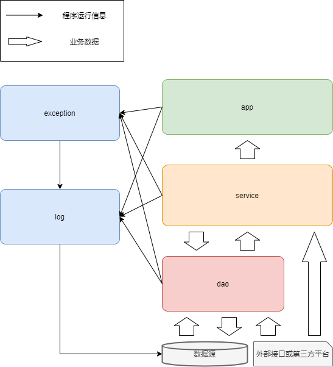

# Spark项目接入工具及使用方式


- [Spark项目开发框架及规范](#spark项目开发框架及规范)
    - [前言](#前言)
    - [功能](#功能)
    - [环境](#环境)
    - [编码框架](#编码框架)
        - [git地址](#git地址)
        - [介绍](#介绍)
            - [工程结构](#工程结构)
            - [数据流向](#数据流向)
            - [配置文件](#配置文件)
                - [1. application.conf](#1-applicationconf)
                - [2. app_config.properties](#2-app_configproperties)                
                - [3. data_config.xml](#3-data_configxml)
                - [4. log4j.properties](#4-log4jproperties)
        - [使用](#使用)
            - [下载](#下载)
            - [业务逻辑编写规范](#业务逻辑编写规范)
                - [1. 基本使用](#1-基本使用)
                - [2. 使用框架接入接口数据](#2-使用框架接入接口数据)
                - [3. 使用框架接入jdbc表数据](#3-使用框架接入jdbc表数据)
                - [4. 代码规范（持续更新）](#4-代码规范持续更新)
            - [App类编写规范](#app类编写规范)
            - [异常处理规范](#异常处理规范)
                - [1. 默认异常处理](#1-默认异常处理)
                - [2. 使用异常处理类](#2-使用异常处理类)
                - [3. 自定义异常处理](#3-自定义异常处理)
            - [日志处理规范](#日志处理规范)
                - [1. spark运行日志](#1-spark运行日志)
                - [2. 自定义的输出信息](#2-自定义的输出信息)
    - [部署规范（持续更新）](#部署规范持续更新)


## 前言

本工具是为解决和预防团队开发过程中的以下问题而设计
1. 业务代码混乱  
    - 团队成员代码风格不一，有的喜欢一长串一长串的写，有的喜欢将过程封装
    - 即使将过程封装了，但是封装的边界没有明确定义，仍然会有人不小心“越界”
2. 读写数据源的API使用不统一
    - 各个计算引擎对各个数据源都有不同的读写API接口提供使用，一些比较繁杂的API可能会被人“错误”使用
    - 同时也会有人时常忘记对应接口如何使用，反复查阅资料
3. 重复的编码工作
    - 理论上所有业务项目，除了业务逻辑是变化的之外，其余应该都是一个不变的模板
    - 开发人员应该专注于变化的业务逻辑，而不是每次都要分一些精力出来处理其他“边边角角”的事情

## 功能

1. 关系型数据库的配置化接入（支持MySQL、SQLServer、Oracle）
2. API数据的配置化接入
3. 支持多表并发、多API并发


## 环境

此处的 “环境” 指
> 1. 用户对集群资源的访问权限
> 2. 在本地运行访问集群的代码时，所需的提前配置

- 首先确保自己可以成功访问集群及需要的资源（库、目录等）。

- 所有工具及版本：通过Maven配置，详见pom.xml文件。

- hosts

    在自己本地hosts文件中添加集群所有机器的域名映射。

- 获取以下文件并放到自己项目的resourse目录下
    ```shell
    hive-site.xml
    hdfs-site.xml
    mapred-site.xml
    core-site.xml
    yarn-site.xml
    cm-auto-in_cluster_truststore.jks
    260371.keytab
    krb5.conf

    ```


## 编码框架

### git地址

    https://github.com/1403783088/bigdata-base.git

### 介绍
    
#### 工程结构

``` shell
spark
├─ src                                              
│  └─ main                                          
│    ├─ resources                                  
│    │  ├─ application.conf       # 并发配置，若不涉及并发编程可不配
│    │  ├─ app_config.properties  # 代码中必须或经常用到的常量值，必须配
│    │  ├─ data_config.xml        # 数据接入配置，若不涉及数据接入可不配                   
│    │  └─ log4j.properties       # 日志配置，必须配
│    └─ scala                                       
│       └─ base.spark                                     
│          ├─ app            # 程序的入口和出口
│          ├─ common         # 用于存放业务相关的公有常量、通用配置等 
│          ├─ dao            # 用于底层数据访问，与底层数据源做交互，包括数据库和Api 
│          ├─ exception      # 用于异常处理，其它模块都可以把可能的异常发送到该模块处理    
|          ├─ log            # 日志处理               
│          ├─ service        # 用于存放具体的业务逻辑                    
│          └─ util           # 工具包，存放各种工具类     
└─ pom.xml                   # 项目的maven配置  
```

#### 数据流向



#### 配置文件

##### 1. application.conf

**并发的配置文件，若代码不涉及并发编程，不需要配置。**   

该文件就是akka-actor的配置文件，默认读class目录下的application.conf，也可以使用-Dconfig.file指定。

``` shell
include "version"

actor {
    default-dispatcher {
        type = "Dispatcher"

        executor = "default-executor" #线程池名称

        default-executor {
        fallback = "fork-join-executor" #线程池类型
        }

        fork-join-executor {

        parallelism-min = 1000 #最小线程数

        parallelism-factor = 3.0 #并发因子

        parallelism-max = 1000 #最大线程数

        task-peeking-mode = "FIFO" #任务分配模式
        }
    }

    default-mailbox {
        mailbox-type = "akka.dispatch.UnboundedMailbox" #邮箱类型

        mailbox-capacity = 1000 # 邮箱容量

        mailbox-push-timeout-time = 10s

        stash-capacity = -1
    }
}

```

##### 2. app_config.properties

包含了框架中用到的常量值，所以有一些参数必须配置。支持环境变量格式，比如本地运行时${user.dir}会被解析为项目的根目录

``` properties
#配置测试hive（可选）
app.db.hive.test = neoj_njl

#impala url，配置本地和集群两种（必配）
app.impala.url.local = jdbc:impala://cdh-master03:25004/ods_erp;request_pool=dev2;AuthMech=3;characterEncoding=UTF-8;SSL=1;UID=260371;PWD=884748;sslTrustStore=${user.dir}/src/main/resources/cm-auto-in_cluster_truststore.jks
app.impala.url.cluster = jdbc:impala://cdh-master03:25004/ods_erp;request_pool=dev2;AuthMech=3;characterEncoding=UTF-8;SSL=1;UID=260371;PWD=884748;sslTrustStore=${user.dir}/cm-auto-in_cluster_truststore.jks

# 邮件配置（必配）
app.mail.user = NotificationDevTwo@gree.com.cn
app.mail.password = BDCdev2geli2
app.mail.url = http://10.2.21.103:8083/msg/mail/send/ex
# 配置收件人，多人用 "," 分割
app.mail.to = 邮箱号@gree.com.cn

# 配置kudu master（必配）
app.kudu.master = cdh-master01:7051,cdh-master02:7051,cdh-master03:7051

# hdfs url（必配）
app.hdfs.url = hdfs://nameservice1

# Kerberos认证信息，配置本地和集群两种（必配）
app.kerberos.user = 260371@GREE.IO
app.kerberos.keytab.local = ${user.dir}/src/main/resources/260371.keytab
app.kerberos.keytab.cluster = ${user.dir}/260371.keytab
app.kerberos.krb5.local = ${user.dir}/src/main/resources/krb5.conf
app.kerberos.krb5.cluster = ${user.dir}/krb5.conf

# log4j.properties的路径（必配）
app.log4j.local = ${user.dir}/src/main/resources/log4j.properties
app.log4j.cluster = ${user.dir}/log4j.properties
```

##### 3. data_config.xml

**接入数据需要的配置，若代码不涉及接入数据，不需要配置。**  

- API的配置说明
    【apis】标签内的配置属于API的配置，这些配置包含了目前所有类型的API信息，正常情况下只需要新增，除非账号过期否则不需要删改。

- table的配置说明
    【table】标签内的配置属于接jdbc表数据需要的配置

``` xml

<?xml version="1.0" encoding="UTF-8"?>
<configuration>
    <apis>
        <type id="std_api"> <!-- 接口类型，用id区分 -->
            <api id="dmp"> <!-- 某类型下有不同配置的接口也使用id区分，id为该API URL中的特有部分，把整个URL放里也可以 -->
                <method>get</method> <!-- 请求方法 -->
                <Content-Type>application/json</Content-Type> <!-- content-type -->
                <params>offset count</params> <!-- 请求参数 -->
                <auth> <!-- 认证信息 -->
                    <username>bdcUser4_api</username> <!-- 用户名 -->
                    <password>bigdata04#2020</password> <!-- 密码 -->
                    <secureKey>h4R35Q8rYdAXls71</secureKey> <!-- 密钥 -->
                </auth>
                <token> <!-- token信息 -->
                    <url>https://adpn.gree.com/_/token/get</url> <!-- 获取token的url -->
                    <method>post</method> <!-- 请求token的方法 -->
                    <Content-Type>application/json</Content-Type> <!-- content-type -->
                </token>
            </api>
            <api id="_"> <!-- id为"_"表示除了特殊以外所有其它接口的配置 -->
                <method>post</method>
                <Content-Type>application/json</Content-Type>
                <params>offset count</params>
                <auth>
                    <username>biguser_erp_norm_reader1</username>
                    <password>benr1200817</password>
                    <secureKey>k72Ybb7pal7gOTaI</secureKey>
                </auth>
                <token>
                    <url>https://adpn.gree.com/_/token/get</url>
                    <method>post</method>
                    <Content-Type>application/json;charset=UTF-8</Content-Type>
                </token>
            </api>
        </type>

        <type id="bann_api">
            <api>
                <method>post</method>
                <Content-Type>application/json</Content-Type>
                <params> </params>
                <auth>
                    <client_id>31T417</client_id>
                    <grant_type>client_credentials</grant_type>
                    <client_secret>q44Pv7</client_secret>
                </auth>
                <token>
                    <url>http://baanApp.gree.com/MICROSERVICEAUTH/oauth/token</url>
                    <method>get</method>
                    <Content-Type>application/json</Content-Type>
                </token>
            </api>
        </type>

        <type id="mes_api">
            <api id="_">
                <method>post</method>
                <Content-Type>application/json</Content-Type>
                <params>fromDate toDate CompanyID</params>
                <auth>
                    <authStr>username=260371&amp;password=260371&amp;client_id=clientForBigDataApi&amp;client_secret=secret&amp;scope=apiForGreeMesBigDataPermission%20offline_access&amp;grant_type=password</authStr>
                    <User-Agent>Fiddler</User-Agent>
                </auth>
                <token>
                    <url>https://sysapp.gree.com/greemesidentityserver/connect/token</url>
                    <method>post</method>
                    <Content-Type>application/x-www-form-urlencoded</Content-Type>
                </token>
            </api>
        </type>

    </apis>

    <table>
        <!-- 更新模式: full,fullpart,delta,deltapart。target为kudu时不能设置part和deltapart-->
        <!-- 重要参数，配置错误会导致主逻辑进入错误分支-->
        <update_type>deltapart</update_type>

        <!-- 增量模式：T0(查询上次增量字段极值，随时取增量，并记录增量字段极值）;T1(取前一天）-->
        <!-- 重要参数，配置错误会导致主逻辑进入错误分支-->
        <delta_mode>T0</delta_mode>

        <!-- 手动配置类型转换规则,【;】区分不同规则,【-】前后为转换对-->
        <type_cast>date-string;decimal-double</type_cast>

        <!-- 数据源 -->
        <source>
            <!-- 数据源类型：oracle/sqlserver/mysql -->
            <type>oracle</type>

            <!-- jdbc连接信息，url、user、password分别填写，url必须写库名 -->
            <url>jdbc:oracle:thin:@//10.2.28.169:1521/PGXT</url>
            <user>dsjpgxt</user>
            <password>gree2017dsjpgxt</password>

            <!-- 数据源表所在的库名，用于获取元数据的注释 -->
            <db>PGXT</db>

            <!-- 源表名：【;】分隔每张表，【*】代表取全库表格，仅供全量表使用 -->
            <table_name>tbl_wxjs_jykt;tbl_wxjs_pjmx_jykt;tbl_wxjs_wxxm_jykt;tbl_wxjs_xxyy_jykt</table_name>

            <!-- 源表增量字段，【;】分隔不同表格增量字段，【-】分隔同一表格多个增量字段 -->
            <!-- 需与table_name一一对应 -->
            <delta_field>cjdt-xgrq;pjcjdt;cjsj;cjsj</delta_field>
        </source>

        <target>
            <!-- 目标表类型：hive,kudu -->
            <type>hive</type>

            <!-- 目标表库名 -->
            <db>neoj_njl</db>

            <!-- hive/kudu目标表名：【;】分隔每张表，需与source的table_name一一对应，且命名需符合数仓命名规则 -->
            <!-- 根据数仓命名规则，前缀：ods层(ods_),cdm层(dwd_/dws_),dwt层(dwt_),ads层(ads_) -->
            <!-- 依据数仓命名规则，全量无后缀，hive增量(_delta),hive增量分区(_delta_part),kudu增量(_delta_kudu) -->
            <table_name>ods_tbl_wxjs_jykt_delta_part;ods_tbl_wxjs_pjmx_jykt_delta_part;ods_tbl_wxjs_wxxm_jykt_delta_part;ods_tbl_wxjs_xxyy_jykt_delta_part</table_name>

            <!-- 目标表增量字段，【;】分隔不同表格增量字段，【-】分隔同一表格多个增量字段 -->
            <!-- 需与table_name一一对应 -->
            <delta_field>cjdt-xgrq;pjcjdt;cjsj;cjsj</delta_field>

            <!-- 目标表分区字段，【;】分隔不同表格的分区字段，【-】前为分区依据字段，【-】后为分区程度信息year(仅分区到年),month(分区到年月),day(分区到年月日)-->
            <partition_field>cjdt-month;pjcjdt-month;cjsj-month;cjsj-month</partition_field>
        </target>
    </table>
</configuration>

```

##### 4. log4j.properties

日志配置，默认读取class目录下的，也可以用-Dlog4j.configuration指定

``` properties

################################################################################
#①配置根Logger，其语法为：
#
#log4j.rootLogger = [level],appenderName,appenderName2,...
#level是日志记录的优先级，分为OFF,TRACE,DEBUG,INFO,WARN,ERROR,FATAL,ALL
##Log4j建议只使用四个级别，优先级从低到高分别是DEBUG,INFO,WARN,ERROR
#通过在这里定义的级别，您可以控制到应用程序中相应级别的日志信息的开关
#比如在这里定义了INFO级别，则应用程序中所有DEBUG级别的日志信息将不被打印出来
#appenderName就是指定日志信息输出到哪个地方。可同时指定多个输出目的
################################################################################
################################################################################
#②配置日志信息输出目的地Appender，其语法为：
#
#log4j.appender.appenderName = fully.qualified.name.of.appender.class
#log4j.appender.appenderName.optionN = valueN
#
#Log4j提供的appender有以下几种：
#1)org.apache.log4j.ConsoleAppender(输出到控制台)
#2)org.apache.log4j.FileAppender(输出到文件)
#3)org.apache.log4j.DailyRollingFileAppender(每天产生一个日志文件)
#4)org.apache.log4j.RollingFileAppender(文件大小到达指定尺寸的时候产生一个新的文件)
#5)org.apache.log4j.WriterAppender(将日志信息以流格式发送到任意指定的地方)
#
#1)ConsoleAppender选项属性
# -Threshold = DEBUG:指定日志消息的输出最低层次
# -ImmediateFlush = TRUE:默认值是true,所有的消息都会被立即输出
# -Target = System.err:默认值System.out,输出到控制台(err为红色,out为黑色)
#
#2)FileAppender选项属性
# -Threshold = INFO:指定日志消息的输出最低层次
# -ImmediateFlush = TRUE:默认值是true,所有的消息都会被立即输出
# -File = C:\log4j.log:指定消息输出到C:\log4j.log文件
# -Append = FALSE:默认值true,将消息追加到指定文件中，false指将消息覆盖指定的文件内容
# -Encoding = UTF-8:可以指定文件编码格式
#
#3)DailyRollingFileAppender选项属性
# -Threshold = WARN:指定日志消息的输出最低层次
# -ImmediateFlush = TRUE:默认值是true,所有的消息都会被立即输出
# -File = C:\log4j.log:指定消息输出到C:\log4j.log文件
# -Append = FALSE:默认值true,将消息追加到指定文件中，false指将消息覆盖指定的文件内容
# -DatePattern='.'yyyy-ww:每周滚动一次文件,即每周产生一个新的文件。还可以按用以下参数:
#              '.'yyyy-MM:每月
#              '.'yyyy-ww:每周
#              '.'yyyy-MM-dd:每天
#              '.'yyyy-MM-dd-a:每天两次
#              '.'yyyy-MM-dd-HH:每小时
#              '.'yyyy-MM-dd-HH-mm:每分钟
# -Encoding = UTF-8:可以指定文件编码格式
#
#4)RollingFileAppender选项属性
# -Threshold = ERROR:指定日志消息的输出最低层次
# -ImmediateFlush = TRUE:默认值是true,所有的消息都会被立即输出
# -File = C:/log4j.log:指定消息输出到C:/log4j.log文件
# -Append = FALSE:默认值true,将消息追加到指定文件中，false指将消息覆盖指定的文件内容
# -MaxFileSize = 100KB:后缀可以是KB,MB,GB.在日志文件到达该大小时,将会自动滚动.如:log4j.log.1
# -MaxBackupIndex = 2:指定可以产生的滚动文件的最大数
# -Encoding = UTF-8:可以指定文件编码格式
################################################################################
################################################################################
#③配置日志信息的格式(布局)，其语法为：
#
#log4j.appender.appenderName.layout = fully.qualified.name.of.layout.class
#log4j.appender.appenderName.layout.optionN = valueN
#
#Log4j提供的layout有以下几种：
#5)org.apache.log4j.HTMLLayout(以HTML表格形式布局)
#6)org.apache.log4j.PatternLayout(可以灵活地指定布局模式)
#7)org.apache.log4j.SimpleLayout(包含日志信息的级别和信息字符串)
#8)org.apache.log4j.TTCCLayout(包含日志产生的时间、线程、类别等等信息)
#9)org.apache.log4j.xml.XMLLayout(以XML形式布局)
#
#5)HTMLLayout选项属性
# -LocationInfo = TRUE:默认值false,输出java文件名称和行号
# -Title=Struts Log Message:默认值 Log4J Log Messages
#
#6)PatternLayout选项属性
# -ConversionPattern = %m%n:格式化指定的消息(参数意思下面有)
#
#9)XMLLayout选项属性
# -LocationInfo = TRUE:默认值false,输出java文件名称和行号
#
#Log4J采用类似C语言中的printf函数的打印格式格式化日志信息，打印参数如下：
# %m 输出代码中指定的消息
# %p 输出优先级，即DEBUG,INFO,WARN,ERROR,FATAL
# %r 输出自应用启动到输出该log信息耗费的毫秒数
# %c 输出所属的类目,通常就是所在类的全名
# %t 输出产生该日志事件的线程名
# %n 输出一个回车换行符，Windows平台为“\r\n”，Unix平台为“\n”
# %d 输出日志时间点的日期或时间，默认格式为ISO8601，也可以在其后指定格式
#    如：%d{yyyy年MM月dd日 HH:mm:ss,SSS}，输出类似：2012年01月05日 22:10:28,921
# %l 输出日志事件的发生位置，包括类目名、发生的线程，以及在代码中的行数
#    如：Testlog.main(TestLog.java:10)
# %F 输出日志消息产生时所在的文件名称
# %L 输出代码中的行号
# %x 输出和当前线程相关联的NDC(嵌套诊断环境),像java servlets多客户多线程的应用中
# %% 输出一个"%"字符
#
# 可以在%与模式字符之间加上修饰符来控制其最小宽度、最大宽度、和文本的对齐方式。如：
#  %5c: 输出category名称，最小宽度是5，category<5，默认的情况下右对齐
#  %-5c:输出category名称，最小宽度是5，category<5，"-"号指定左对齐,会有空格
#  %.5c:输出category名称，最大宽度是5，category>5，就会将左边多出的字符截掉，<5不会有空格
#  %20.30c:category名称<20补空格，并且右对齐，>30字符，就从左边交远销出的字符截掉
################################################################################
################################################################################
#④指定特定包的输出特定的级别
#log4j.logger.org.springframework=DEBUG
################################################################################

#OFF,systemOut,logFile,logDailyFile,logRollingFile,logMail,logDB,ALL
log4j.rootLogger =ALL,systemOut,logFile

#输出到控制台
log4j.appender.systemOut = org.apache.log4j.ConsoleAppender
log4j.appender.systemOut.layout = org.apache.log4j.PatternLayout
log4j.appender.systemOut.layout.ConversionPattern = [%-5p][%-22d{yyyy/MM/dd HH:mm:ssS}][%l]%n%m%n
log4j.appender.systemOut.Threshold = INFO
log4j.appender.systemOut.ImmediateFlush = TRUE
log4j.appender.systemOut.Target = System.out

#输出到文件
log4j.appender.logFile = org.apache.log4j.FileAppender
log4j.appender.logFile.layout = org.apache.log4j.PatternLayout
log4j.appender.logFile.layout.ConversionPattern = [%-5p][%-22d{yyyy-MM-dd HH:mm:ssS}][%l]%n%m%n
log4j.appender.logFile.Threshold = DEBUG
log4j.appender.logFile.ImmediateFlush = TRUE
log4j.appender.logFile.Append = TRUE
log4j.appender.logFile.File = ${user.dir}/logs.log
log4j.appender.logFile.Encoding = UTF-8

##按DatePattern输出到文件
#log4j.appender.logDailyFile = org.apache.log4j.DailyRollingFileAppender
#log4j.appender.logDailyFile.layout = org.apache.log4j.PatternLayout
#log4j.appender.logDailyFile.layout.ConversionPattern = [%-5p][%-22d{yyyy-MM-dd HH:mm:ssS}][%l]%n%m%n
#log4j.appender.logDailyFile.Threshold = DEBUG
#log4j.appender.logDailyFile.ImmediateFlush = TRUE
#log4j.appender.logDailyFile.Append = TRUE
#log4j.appender.logDailyFile.File = ${user.dir}/logs.log
#log4j.appender.logDailyFile.DatePattern = '.'yyyy-MM-dd'.log'
#log4j.appender.logDailyFile.Encoding = UTF-8

##设定文件大小输出到文件
#log4j.appender.logRollingFile = org.apache.log4j.RollingFileAppender
#log4j.appender.logRollingFile.layout = org.apache.log4j.PatternLayout
#log4j.appender.logRollingFile.layout.ConversionPattern = [%-5p][%-22d{yyyy/MM/dd HH:mm:ssS}][%l]%n%m%n
#log4j.appender.logRollingFile.Threshold = DEBUG
#log4j.appender.logRollingFile.ImmediateFlush = TRUE
#log4j.appender.logRollingFile.Append = TRUE
#log4j.appender.logRollingFile.File = ../Struts2/WebRoot/log/RollingFile/log4j_Struts.log
#log4j.appender.logRollingFile.MaxFileSize = 1MB
#log4j.appender.logRollingFile.MaxBackupIndex = 10
#log4j.appender.logRollingFile.Encoding = UTF-8

##用Email发送日志
#log4j.appender.logMail = org.apache.log4j.net.SMTPAppender
#log4j.appender.logMail.layout = org.apache.log4j.HTMLLayout
#log4j.appender.logMail.layout.LocationInfo = TRUE
#log4j.appender.logMail.layout.Title = Struts2 Mail LogFile
#log4j.appender.logMail.Threshold = DEBUG
#log4j.appender.logMail.SMTPDebug = FALSE
#log4j.appender.logMail.SMTPHost = SMTP.163.com
#log4j.appender.logMail.From = xly3000@163.com
#log4j.appender.logMail.To = xly3000@gmail.com
##log4j.appender.logMail.Cc = xly3000@gmail.com
##log4j.appender.logMail.Bcc = xly3000@gmail.com
#log4j.appender.logMail.SMTPUsername = xly3000
#log4j.appender.logMail.SMTPPassword = 1234567
#log4j.appender.logMail.Subject = Log4j Log Messages
##log4j.appender.logMail.BufferSize = 1024
##log4j.appender.logMail.SMTPAuth = TRUE

##将日志登录到MySQL数据库
#log4j.appender.logDB = org.apache.log4j.jdbc.JDBCAppender
#log4j.appender.logDB.layout = org.apache.log4j.PatternLayout
#log4j.appender.logDB.Driver = com.mysql.jdbc.Driver
#log4j.appender.logDB.URL = jdbc:mysql://10.2.7.122:3306/home_device_score
#log4j.appender.logDB.User = devicescoreuser
#log4j.appender.logDB.Password = devicescore!23
#log4j.appender.logDB.Sql = INSERT INTO spark_log(create_time,level,message)values('%d{yyyy-MM-ddHH:mm:ss}','%p','[%-5p][%-22d{yyyy/MM/dd HH:mm:ssS}][%l]%n%m%n')

```

### 使用  

#### 下载  

新建Maven项目，git clone，将下载来的代码复制到自己新建的Maven项目中。

#### 业务逻辑编写规范 

##### 1. 基本使用

在service包下实现自己的业务逻辑，以供app的onRun()方法调用，如果需要SparkSession对象，则必须体现在类或方法的参数列表中。

``` scala
class MyLogic(spark: SparkSession) {
    def logic(): Unit ={
    
    // 你的业务逻辑代码
    spark.table("")
    // ......

    }
}

```

##### 2. 使用框架接入接口数据

前提：配置data_config.xml

``` scala

class MyLogic(spark: SparkSession) {

  def logic(): Unit = {
    /*
    单线程接入接口数据，每个接口内部使用多线程访问
    */
    val api1 = new BannApiDaoImpl(spark, "api url", "target database name", "target table name")
    api1.actorSaveApiJsonFull(api1, startPage = 1, isConcurrent = true)

    /*
    多线程接入接口数据，多个接口并发执行，每个接口内部使用多线程访问
    */
    val actorUtil1 = new ActorUtil

    actorUtil.doSth({
      val api1 = new BannApiDaoImpl(spark, "api url", "target database name", "target table name")
      api1.actorSaveApiJsonFull(api1, startPage = 1, isConcurrent = true)
    })

    actorUtil.doSth({
      val api2 = new BannApiDaoImpl(spark,"api url", "target database name", "target table name")
      api2.actorSaveApiJsonFull(api2, startPage = 1, isConcurrent = true)
    })

    actorUtil1.close

    /*
    推荐使用
    多线程接入接口数据，多个接口并发执行，每个接口内部使用多线程访问，并收集错误信息
    */
    val actorUtil2 = new ActorUtil
    val errList = new ListBuffer[String]
    val logger = Logger.getLogger(getClass)

    actorUtil2.doSthAndCollectException({
      val api1 = new BannApiDaoImpl(spark, "api url", "target database name", "target table name")
      api1.actorSaveApiJsonFull(api1, startPage = 1, isConcurrent = true)
    }, "ttccom100301", errList)

    actorUtil2.doSthAndCollectException({
      val api2 = new BannApiDaoImpl(spark,"api url", "target database name", "target table name")
      api2.actorSaveApiJsonFull(api2, startPage = 1, isConcurrent = true)
    }, "ttccom100410", errList)

    //对错误列表中的错误信息进行打印
    errList.foreach(logger.error)

    actorUtil2.close


  }
}

```

##### 3. 使用框架接入jdbc表数据

前提：配置data_config.xml

``` scala

class MyLogic(spark: SparkSession) {

  def logic(): Unit = {

    /*
      按照data_config.xml的参数接表，若不指定begin和finish，则按照配置的 delta_mode 参数接表
      delta_mode = "T0"，接入数据区间为：[上次接入的最大数据, 现在]
      delta_mode = "T1"，接入数据区间为：[昨天0点, 今天0点)
      参数 begin 指定开始时间，格式 yyyy-MM-dd hh:mm:ss
      参数 finish 指定结束时间，格式 yyyy-MM-dd hh:mm:ss
     */
    new TableImportUtil(spark).accessTables()
  }
}

```

##### 4. 代码规范（持续更新）

- 注释规范

    1. 对于类、类属性、方法和复杂逻辑必须添加注释

    2. 类、类属性、类方法的注释必须使用 Javadoc 规范，使用/** 内容 */格式，不得使用// xxx 方式

    3. 方法内部单行注释，在被注释语句上方另起一行，使用//注释。方法内部多行注释使用/* */注释，注意与代码对齐。

    4. 所有的枚举类型字段必须要有注释，说明每个数据项的用途。

    5. 谨慎注释掉代码。在上方详细说明，而不是简单地注释掉。如果无用，则删除。   
            
  
#### App类编写规范  

在app.impl包下新建自己的主类，继承BaseSparkApp类，实现onRun()方法，在main()方法里直接调用startApp()方法即可。

```scala
class MyApp extends BaseSparkApp {
    /**
    * 在此处调用service层代码
    */
    override def onRun(): Unit = {
        new MyLogic(spark).logic()
    }
}

object MyApp{
    def main(args: Array[String]): Unit = {
        new MyApp().startApp()
    }
}

```

#### 异常处理规范

##### 1. 默认异常处理

exception.BaseExceptionHandler类对异常处理的默认实现：

```scala

/**
* 对传入的异常记录到日志，并以邮件形式发送
*/
override def onException(exceptionInfo: String): Unit = {
    var info = exceptionInfo + "<br/>"

    exception.getStackTrace.foreach(ex => info += ("<br/>" + ex))

    logger.error(info)

    new MailUtil(Constants.MAIL_URL).send(Constants.MAIL_USER, Constants.MAIL_PASSWORD, Constants.MAIL_TO, "Spark程序运行发生异常！", info, "", "")
}

```

##### 2. 使用异常处理类

推荐使用如下代码的格式捕获异常并处理异常：

```scala

Try[T]{

    //code

} match{

    case Success(value) => 
        //code

    case Failure(exception) => 
        new ExceptionHandlerImpl(exception).onException(s"Spark程序 ${spark.sparkContext.appName} 运行发生异常！")
}

```

##### 3. 自定义异常处理

在exception.impl包下新建自己的异常处理类，继承BaseExceptionHandler类，传入Throwable参数，并重写exception成员变量，根据自己的需要重写或添加BaseExceptionHandler类中的方法。

```scala

class MyExceptionHandlerImpl(_exception: Throwable) extends BaseExceptionHandler {

    override protected var exception: Throwable = _exception

}

```

#### 日志处理规范

##### 1. spark运行日志
统一使用log4j.properties配置日志，在workflow中添加log4j.properties，框架会默认将所有文件格式日志的配置路径上传到hdfs上，上传到的hdfs默认路径为：**hdfs://nameservice1/user/当前spark用户名(你的邮箱号)/logs/你的spark应用名/当前spark应用的ApplicationId/日志原文件名**

##### 2. 自定义的输出信息

不使用println()方式打印，统一使用以下方式：

```scala

//初始化类变量
val logger = Logger.getLogger(getClass)

//打印日志
logger.info("logs")

```
        

## 部署规范（持续更新）

1. 统一使用Shell脚本方式提交Spark任务  

    spark提交脚本范例  

    ```shell
    spark-submit \
    --master yarn \ # yarn方式提交
    --deploy-mode cluster \ # yarn-cluster模式
    --name 你的appName \ # spark的appName
    --class 你的主类 \ # 指定主类
    --driver-memory dirver内存 \ # 指定driver内存
    --executor-cores 每个executor核数 \ # 指定executor核数
    --executor-memory 每个executor内存 \ # 指定executor内存
    --conf "spark.dynamicAllocation.enabled=true" \ # 开启动态分配
    --conf "spark.dynamicAllocation.executorIdleTimeout=2m" \ # 动态分配选项，executor空任务等待时长
    --conf "spark.dynamicAllocation.minExecutors=1" \ # 动态分配选项，最少executor数
    --conf "spark.dynamicAllocation.maxExecutors=10" \ # 动态分配选项，最多executor数
    --conf "spark.shuffle.service.enabled=true" \ # 调优配置，选填
    --conf "spark.driver.maxResultSize=10g" \ # 调优配置，选填
    --conf "spark.default.parallelism=10" \ # 调优配置，选填
    --conf "spark.rpc.message.maxSize=512" \ # 调优配置，选填
    --conf "spark.memory.fraction=0.2" \ # 调优配置，选填
    --conf "spark.driver.extraJavaOptions=-Dlog4j.configuration=log4j.properties -Dconfig.file=application.conf -Xss1024M " \ # driver端jvm配置，日志和配置文件必须指定，调优选填
    --conf "spark.yarn.executor.memoryOverhead=30g" \ # 调优配置，选填
    --conf "spark.executor.extraJavaOptions=-Xss1024M -XX:+UseG1GC -XX:InitiatingHeapOccupancyPercent=65  -XX:+PrintGCDetails -XX:+PrintGCTimeStamps" \ # executor端jvm配置，调优选填
    --conf "spark.serializer=org.apache.spark.serializer.KryoSerializer" \ # 调优配置，选填
    --conf "spark.kryoserializer.buffer.max=2047m" \ # 调优配置，选填
    --conf "spark.scheduler.listenerbus.eventqueue.capacity=100000" \ # 调优配置，选填
    --conf spark.jars=jars/你的jar1.jar,jars/你的jar2.jar \ # 指定依赖包，jars相对路径是你自己添加在shell workflow的工作区中的
    --conf spark.files=log4j.properties,application.conf,data_config.xml,app_config.properties \ # 指定配置文件，这些文件都添加在shell workflow的工作区中
    --keytab 260371_1.keytab \ # 指定keytab
    --principal "260371@GREE.IO" \ # 指定用户
    --queue dev2 \ # 指定yarn队列
    你的代码.jar # 指定jar包
    ```
    
2. 统一使用YARN方式提交

3. 测试部署时可以使用yarn-client模式，正式部署必须使用yarn-cluster模式

4. 推荐开启动态资源分配

5. 推荐打jar包时打“瘦包”（即不带依赖的包），然后在Spark提交脚本中时指定依赖即可

6. 配置文件统一不打到jar包里，而是通过--conf spark.files方式指定

7. 统一使用log4j.properties配置日志，在workflow中添加log4j.properties，框架会默认将所有文件格式日志的配置路径上传到hdfs上，上传到的hdfs默认路径为：**hdfs://nameservice1/user/当前spark用户名(你的邮箱号)/logs/你的spark应用名/当前spark应用的ApplicationId/日志原文件名**


